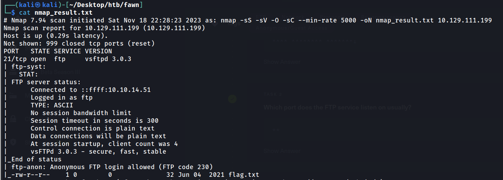

# Machine: Fawn

Tag: `FTP` `Network` `Protocol` `Anonymous` `Guest access Reconnaissance`

## Scanning&#x20;

<figure><figcaption></figcaption></figure>

Scanning the network by using nmap tool and we found that target machine running **ftp server** and which support **anonymous login** and a file is present inside the server.&#x20;

<figure><figcaption></figcaption></figure>

&#x20;logging with anonymous and downloaded the file to our system by using **get** command.&#x20;

<figure><figcaption></figcaption></figure>
